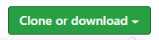

# Pizza Parlor

#### It's always the right time for pizza! Order yours today with this Pizza Parlor app - Independent Project for Epicodus, 06.19.2020

## By Brittany Lindgren

## Description

Have you ever found yourself on a Zoom call, and all of your friends and family are ordering pizzas and eating them in front of you? Well now you don't have to be the sad, pizza-less one. Use our Pizza Parlor app today and join in on the pizza eating fun! Click on the link to [see this project in your browser](LINK HERE).

## Setup/Installation Requirements

| Steps | Example |
| -------- | ----- |
|  1. Follow this [link to the project repository](https://github.com/LINDGRENBA/pizza-parlor.git) on GitHub.   |    |    
|  2. Click on the "Clone or download" button to copy the project link.   |      |   
|  3. If you are comfortable with the command line, you can copy the project link and clone it through your commad line with the command `git clone`. Otherwise, I recommend choosing "**Download ZIP**".   |     |   
|   4. Once the ZIP file has finished downloading, you can right click on the file to view the zip folder in your downloads.   |     |   
|  5. Right click on the project ZIP folder that you have just downloaded and choose the option "**Copy To...**", then choose the location where you would like to save this folder.    |     |   
|  6. Navigate to the final location where you have chosen to save the project folder.   |     |   
|  7. To view the code itself, right click, choose "open with..." and open using a text editor such as VS Code or Atom, etc.   |     |   

#### Additional Setup/Installation Notes:

* You do not need to run a server to view this document.

* No additional code is necessary to view this project.   

## Specifications

| Behavior | Input | Output |  Completed(Y/N?)  |
| -------- | ----- | ------ | -------- |
|  Program will create new Order object with array to hold each pizza customer orders and unique id for each pizza  |  n/a  |  Order {pizzas = [], pizzaId: 0}  |  Y  |
|  Program will add pizza object to pizzas array in order object  |  Order.push(Pizza)  |  Order {pizzas = [myPizza], id = 0}  |  Y  |
|  Program will give each added pizza a unique id  |  pizza1, pizza2  |  pizza1 id = 1, pizza2 id = 2  |  Y  |
|  Program will create a new pizza object with size, crust, sauce and cheese properties and empty toppings array  |  n/a  |  pizza{size: small, crust: thick, sauce: marinara, cheese: mozzarella, toppings = [ ]}  |  Y  |
|  Program will allow customer to choose pizza objects size, crust, sauce and cheese properties and submit form to create pizza object  |  small, thin, garlic-alfredo, vegan  |  myPizza = {size:small, crust:thin, sauce:garlic-alfredo, cheese:vegan}  |  Y  |
|  Program will take in a selection of toppings from user  |  shrimp, olives  |  shrimp, olives  |  Y  |
|  Program will add toppings to new pizza object  |  shrimp, olives, sausage  |   pizza{size: large, crust: thick, sauce: marinara, cheese: mozzarella, toppings = ["shrimp", "olives", "sausage"]}   |  Y  |
|  Program will give cost of pizza  |  user clicks confirm order  |  $15  |  Y  |
|  Program will increase pizza cost by $1 for each veggie topping added and $3 for each protein option added |  user selcts 5 veggie toppings and 1 protein  |  price increases by $5 + $3  |  Y  |
|  Program will increase pizza cost by $3 if size is large |  size:large  |  price increases by $3  |  Y  |
|  Program will increase pizza cost by $3 if cheese is vegan |  cheese:vegan  |  price increases by $3  |  Y  |
|  Program will increase pizza cost by $3 if crust is stuffed  |  crust:stuffed  |  price increases by 3  |
|  Program will assign a unique id to each topping before adding it to object  |  onion, olives  |  onion id = 1, olives id = 2  |  N  |
|  Program will delete topping  |  user selects sausage topping and chooses delete icon  |  toppings: shrimp  |  N  |
|  Program will allow user to update or change pizza details before placing order  |  user selects large, thin crust and vegan cheese  |  pizza{size: large, crust: thin, sauce: marinara, cheese: vegan, toppings = [ ]}  |  N  |
|  Program will allow user to add second pizza to order  |  User selects 'order another pizza' button  |  new Pizza object is created  |  N  |
|  Program will allow user to edit their order before finalizing  |  user selects edit, unchecks olives  |  total price reduces by $1, olives deleted from order  |  N  |

## Known Bugs

| Location (html/css/js & specific location if known) |  Message  | Bug | Resolved (Y/N) |  How was the issue resolved?  |
| ------- | ----- | ------ | ------ | --------- |
| scripts.js | Cannot read property 'push' of undefined | cannot pass veggieArray to .addVeggies function? |  Y  |  Created separate .click functions as siblings of .submit function in user interface, updated syntax of addVeggies and addProtein .click functions in user interface  |
|  scripts.js | Uncaught reference error myPizza is not defined | function to add veggie toppings to pizza unable to access myPizza |  Y  |  Moved .click functions for addVeggies and addProtein to inside of order form .submit function  |  
| scripts.js | scripts.js:48 Uncaught TypeError: Cannot read property 'length' of undefined| order summary does not populate if user does not select at least one checkbox from both veggie and protein options| Y | Update styling of page to walk user through each step, add Previous and Next buttons so user can move through form without adding any toppings |
| scripts.js | no message | After user calculates total, if user clicks calculate total again, displayed price increases by cost of selected toppings | Y | Once user has clicked button to calculate order, scripts.js will hide it so that user cannot click again |
|  scripts.js  |  no message  |  If user clicks previous button and returns to step 1 to change initial options, program creates a second myPizza object (id = 2) with the new values instead of replacing the initial values (probably because 'begin order' is the button that creates a new object. Consider changing the button - maybe "start new order" and adding a button - maybe "next" so that you have two different buttons for two seperate actions)  |  N  |    |

## Support and contact details

Please feel free to contact me through GitHub (username: LINDGRENBA) with any questions, ideas or concerns.  

## Technologies Used

* HTML5
* CSS3
* Bootstrap v-3.3.7
* JavaScript
* jQuery v-3.5.0
* Visual Studio Code 
* Git and Git BASH 

### License

*This site is licensed under the MIT license.*

Copyright (c) 2020 **_Brittany A Lindgren_**